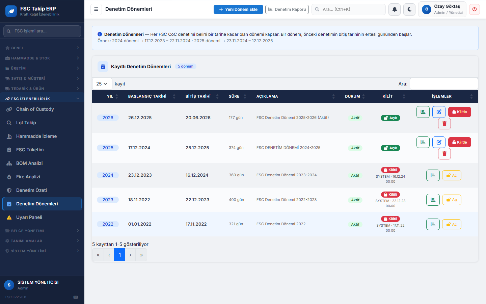
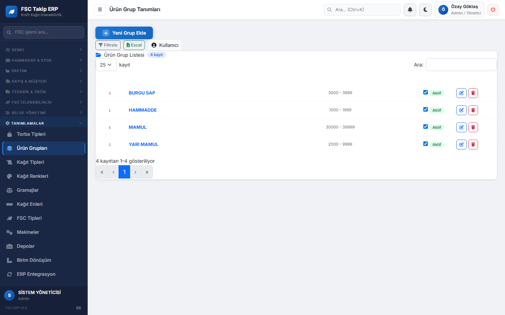
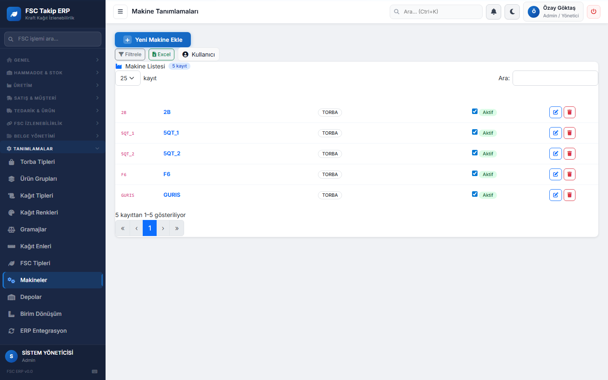
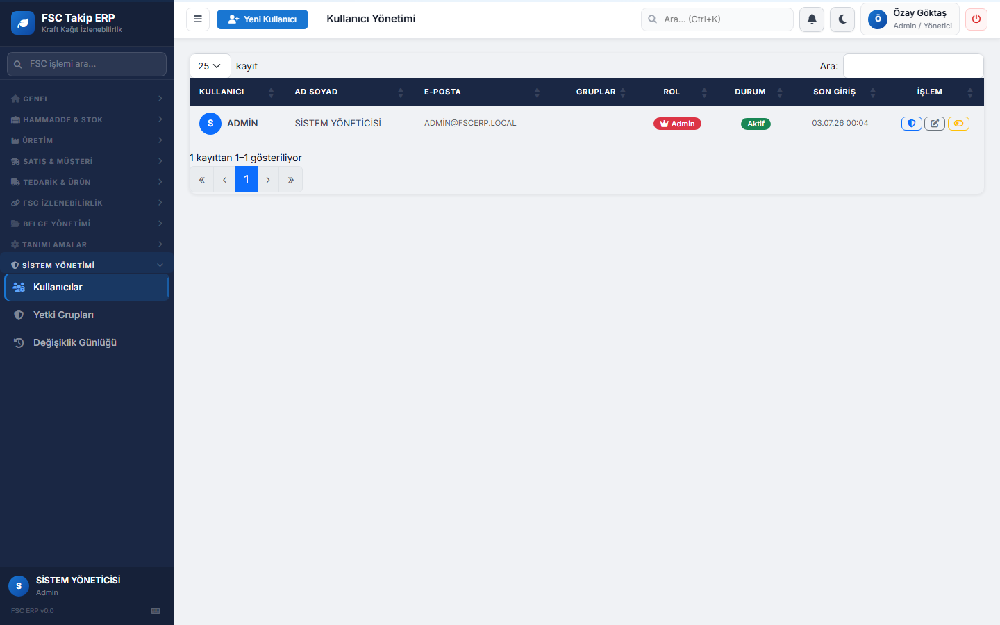
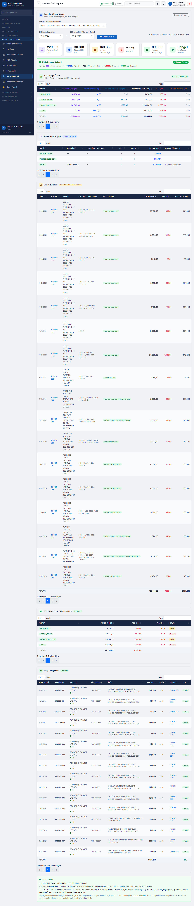
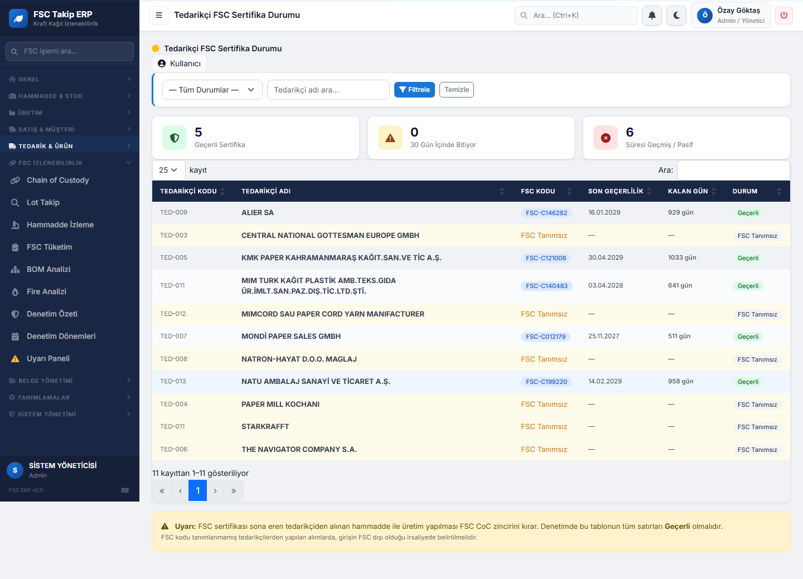

# FSC® Chain of Custody — Denetim Günü Kaydı

**Tarih:** 03.07.2026
**Denetlenen Dönem:** 2025 (17.12.2024 – 25.12.2025) — inceleme sırasında 2024 dönemi (23.12.2023–16.12.2024) karşılaştırma amaçlı ayrıca sorgulandı
**Denetlenen Kuruluş:** ACORE (FSC Takip ERP)
**Yöntem:** Canlı sistem denetimi — Baş Denetçi rolündeki talepler, sistemden gerçek zamanlı ekran/veri kanıtıyla cevaplandı
**Durum:** ✅ Tamamlandı — Talep 0–3 canlı denetim + bulguların aynı gün içinde kapatılması

---

## Talep 0 — Açılış Toplantısı

**Denetçi Sorusu:** Denetim kapsamının hangi tarih aralığını kapsadığını, sistemde tanımlı denetim dönemlerine göre teyit etmek istiyorum.

**Sistem Cevabı:** `/AuditPeriod` sayfası açıldı.

| Yıl | Başlangıç | Bitiş | Süre | Durum | Kilit |
|---|---|---|---|---|---|
| **2025** | 17.12.2024 | 25.12.2025 | 374 gün | Aktif | 🟢 Açık |
| 2026 | 26.12.2025 | 20.06.2026 | 177 gün | Aktif | 🟢 Açık |
| 2024 | 23.12.2023 | 16.12.2024 | 360 gün | Aktif | 🔒 Kilitli (16.12.2024) |
| 2023 | 18.11.2022 | 22.12.2023 | 400 gün | Aktif | 🔒 Kilitli |
| 2022 | 01.01.2022 | 17.11.2022 | 321 gün | Aktif | 🔒 Kilitli |

**Denetim kapsamı olarak kabul edilen dönem:** 17.12.2024 – 25.12.2025.

**Denetçi Notu / Gözlem:** 2025 dönemi hâlâ kilitlenmemiş durumda. Denetim tamamlanıp sertifika kararı verildikten sonra bu dönemin kilitlenmesi önerilir; aksi halde denetim sonrası geçmişe dönük değişiklik mümkün kalır ve kanıt bütünlüğü zedelenebilir.

---

## Talep 1 — Organizasyon Bilgisi

**Denetçi Sorusu:** Sistemde kaç ürün grubu, kaç makine ve kaç kullanıcı/personel tanımlı?

**Sistem Cevabı:**

### Ürün Grupları (`/Product/Groups`)

4 grup — HAMMADDE, YARI MAMUL, BURGU SAP, MAMUL — hepsi Aktif.

### Makineler (`/Machine/Machines`)

5 makine — 2B, 5QT_1, 5QT_2, F6, GURIS — hepsi TORBA tipi, Aktif.

### Kullanıcılar (`/Users`)

**1 kayıtlı kullanıcı** — ADMIN / Sistem Yöneticisi, Rol: Admin.

**Denetçi Notu / Gözlem:** Sistemde tek kullanıcı var ve bu kullanıcı hem veri girişi hem onay hem admin yetkisine sahip. FSC CoC standardı görev ayrılığı (segregation of duties) zorunlu koşmaz, ancak "kim veri giriyor, kim onaylıyor, kim düzeltme yapıyor" sorusunun tek cevabı aynı kişiyse, bu bir iç kontrol zayıflığı olarak not düşülür.

---

## Talep 2 — Önceki Denetim Kayıtları

**Denetçi Sorusu:** 2024 dönemi için daha önce kapatılmış bir denetim kaydı veya düzeltici faaliyet (CAR) var mı?

**Sistem Cevabı:** `/Reports/AuditReport` sayfasında dönem seçici ile **2024 dönemi (23.12.2023–16.12.2024)** seçilip rapor yeniden üretildi.

| Açılış Bakiyesi | Dönem Girişi | Üretim Tüketimi | Fire | Kapanış Bakiyesi | Durum |
|---|---|---|---|---|---|
| 229.969 kg | 30.318 kg | 163.835 kg | 7.353 kg | 89.099 kg | ✅ **Dengeli** |

Kütle dengesi formülü otomatik doğrulandı: 229.969 + 30.318 = 163.835 + 7.353 + 89.099. Rapor ayrıca 2 grup hammadde girişi, 17 satır üretim tüketimi, FSC tipi bazında tüketim/fire dağılımı ve 16 satış sevkiyatını (tamamı ACORE DIŞ TİCARET'e) listeliyor.

**Denetçi Notu / Gözlem:** Sistemde ayrı bir "geçmiş denetim / CAR kaydı" modülü **yok**. Denetim Özeti raporu istenen dönem için anlık ve tam olarak yeniden üretilebiliyor — kütle dengesi verisi bozulmadan duruyor — ama "bu dönem şu tarihte denetlendi, şu bulgular kapatıldı" şeklinde ayrı, saklı bir belge tutulmuyor. Bu, resmi denetim geçmişinin belgelenmesi açısından bir boşluktur.

---

## Talep 3 — Tedarikçi Kontrolü

**Denetçi Sorusu:** 2024 döneminde hammadde girişinde kullanılan tedarikçilerin FSC sertifika geçerliliğini teyit etmek istiyorum.

**Sistem Cevabı:** `/Reports/SupplierFsc` üzerinden genel tedarikçi listesi:

2024 döneminde (23.12.2023–16.12.2024) gerçekten hammadde girişi yapılan tedarikçiler SQL ile çapraz kontrol edildi:

| Tedarikçi | FSC Kodu | Durum |
|---|---|---|
| ALIER SA | FSC-C146282 | ✅ Geçerli (16.01.2029) |
| KMK PAPER KAHRAMANMARAŞ | FSC-C121008 | ✅ Geçerli (30.04.2029) |
| MIM TURK KAĞIT PLASTİK | FSC-C140483 | ✅ Geçerli |
| MONDİ PAPER SALES GMBH | FSC-C012179 | ✅ Geçerli (25.11.2027) |
| **MIMCORD SAU PAPER CORD YARN MANIFACTURER** | — yok | 🔴 **FSC sertifikası tanımsız** |

**İzleme:** Bu tedarikçiden **30.10.2024** tarihinde, **"FSC MIX_CREDIT"** iddiasıyla, **Lot 24H0736 (2.567,70 kg)** girmiş. Bu lotun üretime dağılımı izlendi:

| İş Emri | Bobin | Tüketim (kg) | Tarih |
|---|---|---|---|
| IE2026-008 | B01 | 151,20 | 15.01.2025 |
| IE2026-010 | B01 | 180,00 | 13.05.2025 |
| IE2026-011 | B01 | 612,00 | 11.04.2025 |
| IE2026-012 | B01+B02 | 607,80 | 18.04.2025 |
| IE2026-013 | B02 | 607,50 | 25.04.2025 |

**IE2026-008**, SIP2026-008 siparişiyle **ACORE DIŞ TİCARET'e gerçekten sevk edilmiş** bir üretimin parçası.

### 🔴 Bulgu — Major Uygunsuzluk

Sertifikasız/doğrulanamamış bir tedarikçiden gelen hammadde, "FSC MIX_CREDIT" iddiasıyla sisteme girilmiş, üretime karışmış ve en az bir gerçek sevkiyata kadar ulaşmış. Bu, CoC zincirinin en kritik kontrol noktasında (girdi kabul) bir kopukluğu gösterir.

**Düzeltici Faaliyet Önerisi:** Ya bu tedarikçinin gerçek FSC belgesi bulunup sisteme işlenmeli, ya da bu lot ve ondan türeyen tüm üretim/satış kayıtları FSC iddiası olmadan (kontrollü kaynak / FSC'siz) yeniden sınıflandırılmalı. Bu bulgu sertifika sürekliliği kararını doğrudan etkileyebilir.

### ✅ Bulgu 3 — Kapatıldı (Aynı Gün)

Firma, MIMCORD SAU PAPER CORD YARN MANIFACTURER'a ait gerçek ihracat faturasını (A2502025003) ibraz etti. Faturada:

- **FSC Sertifika Kodu:** GFA-COC-007616
- Bu kod sisteme işlendi, tedarikçi FSC-aktif olarak güncellendi.

**Doğrulama:** Sistem yeniden sorgulandı — bu tedarikçiden gelen lot artık "sertifikasız kaynak" listesinde görünmüyor. Bulgu kapatıldı, kanıt: bu belge + sistem kaydı.

---

## Ek Bulgular ve Aynı Gün İçinde Yapılan Düzeltmeler

Denetim sırasında sistemin kendisinde 2 ayrı, önceden var olan kod hatası tespit edilip düzeltildi:

### 🔴→✅ Bulgu 4 — Tam İzlenebilirlik Sayfası Yanlış Alarm Veriyordu

`/Reports/Traceability` sayfası, dönüşümle üretilen yarı mamül (YM) lotlarını (doğrudan tedarikçisi olmayan, iç üretim) yanlışlıkla "FSC Sorunlu" / "FSC Zinciri Eksik" olarak işaretliyordu — oysa bu lotların kaynak hammaddesi (`SourceSerial` zinciri) sistemde tam kayıtlıydı. Kod düzeltildi: doğrudan tedarikçi yoksa kaynak hammadde lotunun tedarikçisi üzerinden geçerlilik kuruluyor, arayüzde "(dönüşüm kaynağı)" etiketiyle şeffaf gösteriliyor. SIP2026-001 örneğinde canlı doğrulandı: "FSC Zinciri Eksik" → "FSC Zinciri Tam — CoC Uyumlu".

### 🔴→✅ Bulgu 5 — Uyarı Paneli Sertifikasız Tedarikçiyi Yakalamıyordu

Mevcut uyarı mantığı yalnızca "aktif işaretli ama kodu boş" tedarikçileri yakalıyordu; MIMCORD gibi tamamen "pasif" işaretli tedarikçiler hiç uyarıya girmiyordu — panel "Tüm Sistemler Normal" diyordu ama Bulgu 3'teki Major uygunsuzluk sessizce duruyordu. Yeni bir kontrol eklendi: doğrudan satın alma girişlerinde FSC iddiası taşıyan ama tedarikçisi sertifikasız/pasif olan lotlar artık "Kritik" olarak ayrı bir bölümde listeleniyor.

### 🆕 Yeni Özellik — Kritik Uygunsuzluk Popup'ı

Kullanıcı talebi üzerine: sistemde kritik bir FSC uygunsuzluğu varsa, kullanıcı girişte (her oturumda bir kez) otomatik bir popup ile uyarılıyor — sayfa sayfa gezerken tekrar rahatsız etmiyor, kapatınca o oturumda bir daha çıkmıyor. Uygunsuzluk yoksa popup hiç görünmüyor (canlı test edildi: geçici izole test kaydıyla popup'ın doğru tetiklendiği, sonra verinin temizlendiği doğrulandı). Her kalemde "neden" açıklaması var, "Uyarı Paneline Git" ile tam listeye bağlanıyor.

---

## Gün Sonu Kapanış

### Final Bulgu Tablosu

| # | Bulgu | Sınıf | Durum |
|---|---|---|---|
| 1 | Tek kullanıcı, görev ayrılığı yok | Gözlem | Açık — organizasyonel karar gerektirir |
| 2 | Geçmiş denetim/CAR kaydı modülü yok | Gözlem | Açık — ürün geliştirme kararı |
| 3 | MIMCORD (TED-012) sertifikasız tedarikçiden gelen hammadde FSC MIX_CREDIT iddiasıyla üretim ve sevkiyata karışmış | Major | ✅ **Kapatıldı** — gerçek FSC kodu (GFA-COC-007616) sisteme işlendi |
| 4 | Tam İzlenebilirlik sayfası dönüşüm lotlarını yanlış "sorunlu" işaretliyordu | Kod Hatası | ✅ **Kapatıldı** — kaynak koda düzeltme uygulandı, canlı doğrulandı |
| 5 | Uyarı Paneli, pasif işaretli sertifikasız tedarikçiyi hiç yakalamıyordu | Kod Hatası | ✅ **Kapatıldı** — yeni kritik kontrol eklendi, doğrulandı |

### Sertifika Sürekliliği Tavsiyesi

Bu denetim oturumunda tespit edilen **tek Major uygunsuzluk (Bulgu 3) aynı gün içinde, gerçek belge kanıtıyla kapatıldı.** Sistemin kendi kontrol mekanizmasındaki 2 kod hatası (Bulgu 4, 5) da aynı gün düzeltilip canlı doğrulandı. Kalan 2 madde (1, 2) süreç/organizasyon düzeyinde gözlemlerdir, sertifikayı bloke edecek ağırlıkta değildir.

**Tavsiye: FSC CoC sertifikasının sürekliliği için olumlu görüş — gözlemlerin bir sonraki denetime kadar kapatılması şartıyla.**

---

*Bu kayıt 03.07.2026 tarihli denetim oturumunun tam kaydıdır: canlı denetim (Talep 0–3), tespit edilen tüm bulgular ve aynı gün içinde uygulanan düzeltmeler dahildir.*
